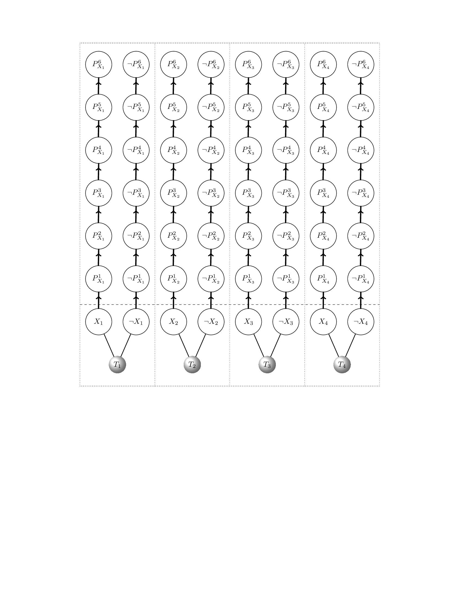
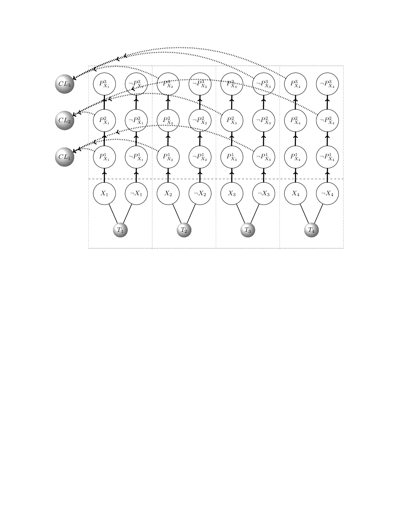
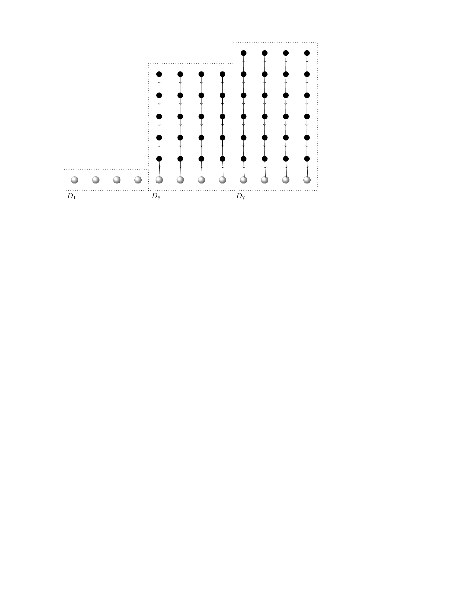
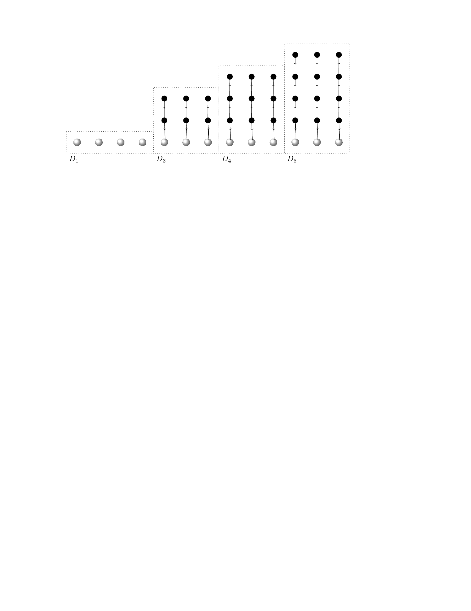
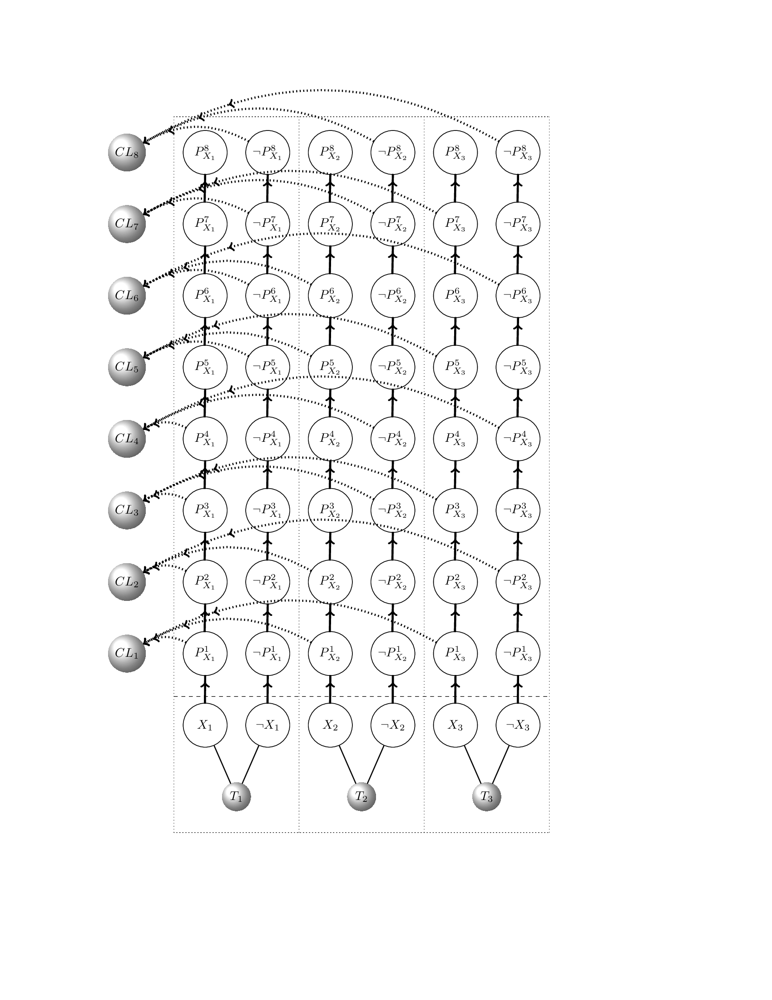

# output-control
Code for Structural output controllability

## Detail Usage
See appendix in https://www.doria.fi/handle/10024/130607

## Example

### Clause Stage

```Latex
\clauseStage{6}{4}
```


----

```Latex
\clauseStage{3}{4}{1,1,2,-3;2,1,3,-4;3,2,-3,4}
```


### Discrete Stage for degree bounded construction
```Latex
\discreteNStage{3}{4}{3}
```


### Discrete Stage for edges bounded construction
```Latex
\discreteEStage{3}{4}
```


### Unsatisfiable clauses 
```Latex
\clauseStage{8}{3}{1,1,2,3;2,1,2,-3;3,1,-2,3;4,1,-2,-3;5,-1,2,3;6,-1,2,-3;7,-1,-2,3;8,-1,-2,-3}
```



